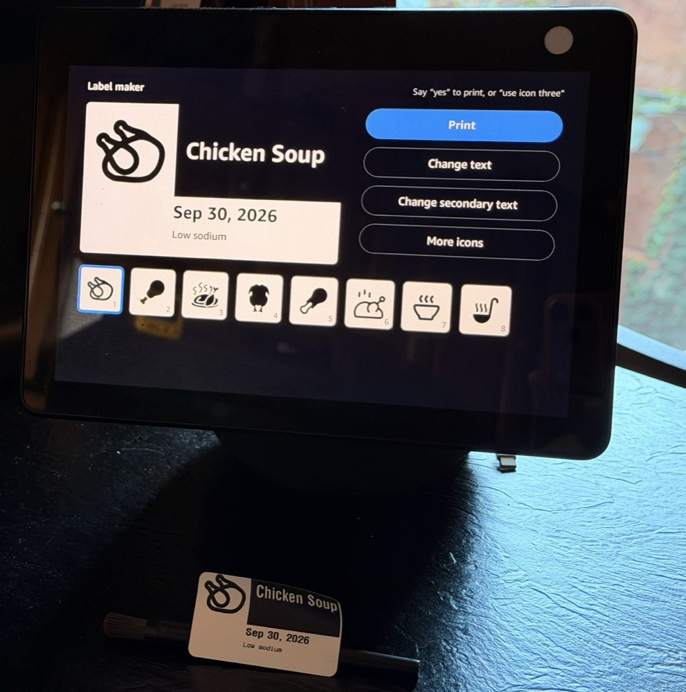
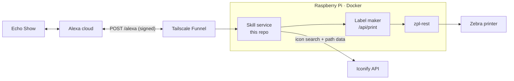

# 2-Click Label Maker for Alexa

*Say "Alexa, open label maker," then "chicken soup." Your Echo Show previews the label, with an icon and today's date, and reads it back. Say "yes" and it prints on your Zebra printer.*



*The preview on an Echo Show 15, and the label it printed.*

A voice and touch front end for [2-Click Label Maker](https://github.com/raypp2/2click-label-maker-zebra). The default path is three steps: ask, look, say yes. Everything else is optional: tap a different icon, change the text, add secondary text, or ask for more copies before anything prints.

**Supported functions**
- Preview the label on the Echo Show you spoke to, drawn in the Food label's real 2.2" × 1.25" proportions
- Read the label back and print only after "yes" or a tap on Print
- Eight icon choices on screen from the start: tap one to swap it instantly, or say "three" or "use the bowl icon"
- Change the text, add secondary text, set the date, or print up to ten copies, by voice or touch
- Pick icons by the specific ingredient ("chicken soup" shows a chicken, "butternut squash soup" a squash)

## How it works

The design, decisions and test results are in [docs/requirements.md](docs/requirements.md).



- **No Lambda.** The skill is a custom skill with its own HTTPS endpoint, hosted on the same Pi as the label maker. Tailscale Funnel gives it a public HTTPS address, and nothing is port-forwarded.
- **The preview is native, not an image.** Echo Show screens can't display SVG, so Iconify icons are converted to Alexa Vector Graphics ([`src/avg.js`](src/avg.js)). A tap swaps the preview icon on the device with no round trip.
- **Label layout is defined once,** in the label maker's `labelConfig.js`. On "yes" this service calls the label maker's existing `/api/print`, exactly as its web UI does.

## Requirements

- [2-Click Label Maker](https://github.com/raypp2/2click-label-maker-zebra) and [zpl-rest](https://github.com/mrothenbuecher/zpl-rest), running in Docker Compose
- An Amazon developer account and an Echo Show on the same Amazon account
- A [Tailscale](https://tailscale.com) tailnet with MagicDNS and HTTPS certificates enabled
- Node 20+ for local tests

## Setup

### 1. Create the Alexa skill

In the [Alexa developer console](https://developer.amazon.com/alexa/console/ask), create a **Custom** skill with **Provision your own** hosting in English (US). Then either paste [`skill-package/interactionModels/custom/en-US.json`](skill-package/interactionModels/custom/en-US.json) into Build → JSON Editor, or deploy it with the ASK CLI:

```bash
ask smapi set-interaction-model -s <skill-id> -g development -l en-US --interaction-model "file:skill-package/interactionModels/custom/en-US.json"
```

Under Build → Interfaces, turn on **Alexa Presentation Language**. Replace the template store listing (Distribution → Skill Preview) with a real name, description and example phrases. See [Known issues](#known-issues) for why this matters on Alexa+.

### 2. Give the skill its own Tailscale node

The skill gets a separate Tailscale node, `tag:alexa`, so only this one service is public. Add this to your tailnet policy:

```jsonc
"tagOwners": { "tag:alexa": ["autogroup:admin"] },
"nodeAttrs": [ { "target": ["tag:alexa"], "attr": ["funnel"] } ],
```

Give the tag no ACL rules. The node then can't reach anything on your tailnet. A policy test locks that in:

```jsonc
{ "src": "tag:alexa", "deny": ["<your-server>:22"] },
```

Generate an auth key (Settings → Keys) tagged `tag:alexa`, not reusable, not ephemeral. Put it in `alexa/.env`, copied from [`deploy/ts-alexa.env.example`](deploy/ts-alexa.env.example).

### 3. Deploy next to the label maker

Assuming the label maker's compose project lives in `~/labelmaker` with its UI service named `ui`:

```bash
mkdir -p ~/labelmaker/alexa/app ~/labelmaker/alexa/ts-state
rsync -a --exclude node_modules --exclude .git ./ pi:labelmaker/alexa/app/
scp deploy/serve.json deploy/firewall.sh pi:labelmaker/alexa/
```

Then:
1. Append [`deploy/docker-compose.alexa.yml`](deploy/docker-compose.alexa.yml) to the label maker's `docker-compose.yml`.
2. Set `SKILL_ID` (see [`deploy/.env.example`](deploy/.env.example)).
3. Run `docker compose up -d --build ts-alexa alexa`.

The skill is served at `https://<node>.<tailnet>.ts.net/alexa`. Set that as the skill's HTTPS endpoint, with certificate type "trusted certificate authority".

Start with `DRY_RUN=1`. Print jobs are logged instead of printed until you're happy with the flow.

### 4. Enable testing

In the console's Test tab, enable testing in Development. The skill then works on Echo devices registered to your developer account. It doesn't need certification.

## Talking to it

| You say | It does |
|---|---|
| "Alexa, open label maker" … "chicken soup" | Preview and read-back |
| "Alexa, ask label maker to make a label for chicken soup" | The same, in one sentence |
| "yes" / "print it" / tap **Print** | Prints and ends |
| "three" / "use icon three" / "the third one" / tap a tile | Selects that icon |
| "different icon" / tap **More icons** | Next page of icons |
| "change the text to chicken noodle soup" | New text, keeps your icon |
| "add a note freeze by Friday" / "add spicy underneath" | Secondary text |
| "two copies" | Copies (max 10) |
| "change the date to yesterday" / "no date" | Date |
| "no" / "cancel" | Ends without printing |

## Security

The endpoint is public by design: Alexa's servers have to reach it. Four layers keep that safe:

- **Only Alexa can call it.** Every request's signature and timestamp are verified with Amazon's official adapter, and requests for any other skill ID are rejected. An unsigned or forged request gets HTTP 400.
- **Only `/alexa` is published.** Funnel forwards nothing else, and the service returns 404 for any other path.
- **The node is isolated on the tailnet.** `tag:alexa` has no ACL rules.
- **The containers are firewalled** ([`deploy/firewall.sh`](deploy/firewall.sh)). Rootless Docker sends container traffic out through the host, including the host's own `tailscale0`. Without this firewall the skill would inherit the host's tailnet access and reach your LAN. The firewall refuses `100.64.0.0/10` and private ranges, and allows only the Docker network (the label maker) and the public internet.

After deploying, verify the isolation from inside the container. A connection to one of your tailnet devices should be refused:

```bash
docker exec labelmaker-alexa node -e "require('net').connect(22,'<tailnet-ip>').on('connect',()=>console.log('REACHABLE')).on('error',e=>console.log('blocked',e.code))"
```

## Development

```bash
npm install
npm test        # 14 tests; handlers are invoked with recorded-style Alexa requests, printing in dry-run
```

`ask smapi profile-nlu -s <skill-id> -l en-US -g development --utterance "three"` shows which intent a phrase resolves to. It's the quickest way to debug "Alexa didn't understand me." On the Pi, the skill logs one `[request]` line per request.

## Known issues

- **Alexa+ sometimes answers on the skill's behalf.** On Alexa+ accounts, "open label maker" occasionally never reaches the skill. Alexa+ replies itself, as a bubble at the bottom of the screen rather than the skill's full screen, and the follow-up goes to Alexa's built-in printing ("no printers found"). Say "cancel" and try again. A distinctive invocation name may help. Routines can't launch the skill, because Amazon requires a skill to be published before it can appear in routines.
- **"print …" can be taken by Alexa's built-in printing** when said as a one-shot request. Opening the skill first, or using "make a label for …", avoids it.
- **Food labels only** for now; Box and Jewelry are on the label maker's web UI.

## Acknowledgements

- Icons from [Iconify](https://iconify.design/) and the open-source sets it hosts (Tabler, Lucide, Material Design, Phosphor, Fluent, Game Icons and others), each under its own license
- [Alexa Skills Kit SDK for Node.js](https://github.com/alexa/alexa-skills-kit-sdk-for-nodejs)
- The printing side: [2-Click Label Maker](https://github.com/raypp2/2click-label-maker-zebra), with [zpl-rest](https://github.com/mrothenbuecher/zpl-rest) by mrothenbuecher and [zpl-image](https://github.com/metafloor/zpl-image) by metafloor
