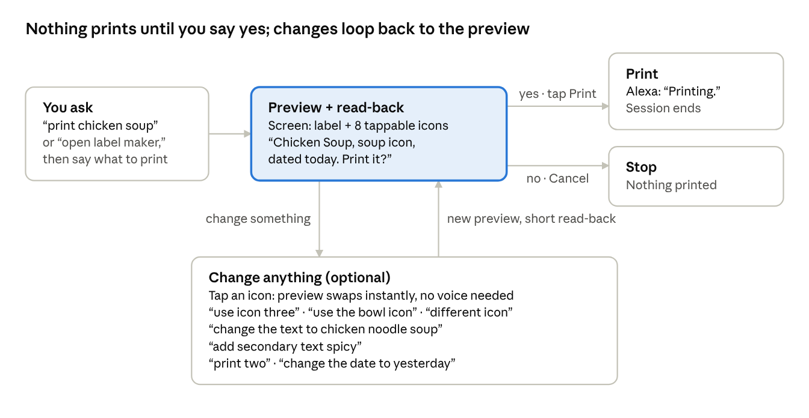
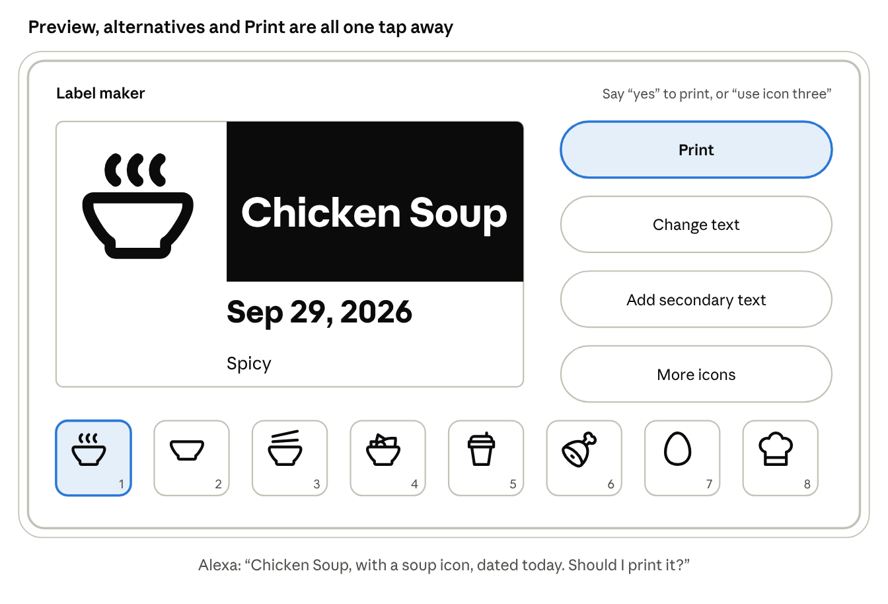
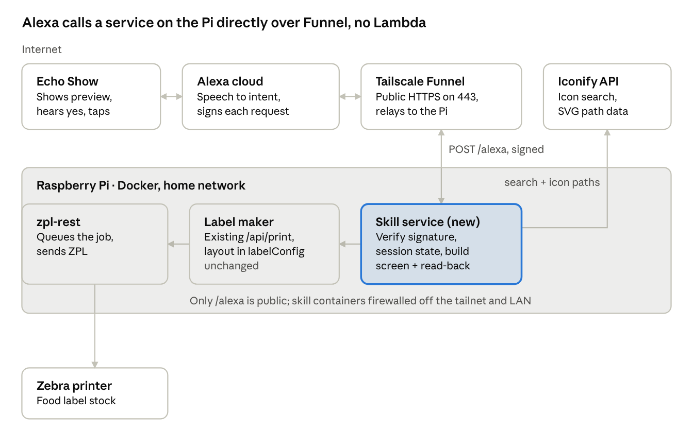

# Alexa Label Maker — Requirements

Sep 30, 2026 · Ray Perfetti

Built and live on the Echo Show 15 since September 30, 2026. Say "Alexa, open label maker," then "chicken soup," see the label on screen, hear it read back, and say "yes" to print. Code: this repo, cross-linked from [2click-label-maker-zebra](https://github.com/raypp2/2click-label-maker-zebra). Sections below record what was built and where it differs from the original plan.

## Goals and design principles

The default path is three steps: ask, look, say yes. Everything else is optional and never blocks that path.

1. **Confirm before paper.** Nothing prints until Ray has seen the preview and heard it read back, then said "yes" or tapped Print.
2. **Easiest option wins.** The skill picks the top icon, today's date, one copy and the Food label on its own. Ray only speaks up to change something.
3. **Customize without modes.** Alternative icons sit on screen from the start and swap with one tap. There is no separate "icon picking" step.
4. **Voice and touch are equal.** Every action works by voice or by tap, in any order, in the same session.
5. **The preview looks like the label.** The screen shows the real layout: icon left, white-on-black primary text, date and secondary text below, in 2.2 × 1.25 proportions.
6. **The screen you ask is the screen you see.** The preview renders on the Echo Show that heard the request.

**Out of scope for v1:** Box and Jewelry labels (Food only), voice-only Echo devices without screens, and invoking without saying "label maker".

## Conversation flow

The fast path is the top row: ask, see and hear the preview, say yes. Any change loops through the box below and returns to the same preview with a shorter read-back ("Chicken noodle soup, bowl icon. Print it?"). An icon tap updates the screen without a voice reply, so a tap then "yes" takes about two seconds.

## Screen design

One screen does everything: the label on the left, actions on the right, and the eight icon choices along the bottom, numbered so they can be spoken.

**The preview is drawn natively, not as a picture.** The label is built from screen components: a black box with white bold text, the date, secondary text and the icon as a vector graphic, laid out in the real label's 2.2 × 1.25 proportions. That's what makes the icon swap instant: tapping a tile changes the preview on the device with no round trip, then tells the skill in the background. It's semi-accurate: Echo fonts are Amazon Ember, not the printer's condensed font, so line breaks can differ slightly on long text. An exact Labelary render is the optional F15.

**Built as designed and verified on the Echo Show 15:** preview, action buttons and eight numbered tiles, with the tap-to-swap icon working on device. Show 10 and Fire TV use the same responsive layout but haven't been tried on hardware.

## Functional requirements

Every Must and Should requirement shipped except F13's time limit, which Alexa controls. Could items remain for v2.

| ID | Requirement | Priority | Status |
| --- | --- | --- | --- |
| F1 | "Alexa, ask label maker to {phrase}" renders a preview and speaks a read-back in one response | Must | Built. One-shot "print …" can be taken by Alexa's built-in printing; "make a label for …" is safer |
| F2 | "Alexa, open label maker" asks "What should the label say?" and accepts a bare answer | Must | Built and verified on device |
| F3 | Read-back names the text, icon and date, then asks "Should I print it?" with the mic open | Must | Built |
| F4 | "Yes" or tapping Print sends the job and says "Printing"; "No" or Cancel ends without printing | Must | Built; real labels printed |
| F5 | Top Iconify result pre-selected; 7 more alternatives as a tappable row | Must | Built. Ranking favors the specific ingredient (chicken, squash) over the dish (soup) |
| F6 | Tapping an alternative swaps the preview icon instantly on device and records it with the skill | Must | Built and verified on device |
| F7 | Voice icon changes: "three", "use icon three", "the third one", "different icon" | Must | Built. Bare numbers and ordinals added after the first device test |
| F8 | "Change the text to {text}" updates the preview and re-reads | Must | Built; keeps the chosen icon first |
| F9 | Secondary text by voice ("add a note …", "add … underneath") and by the button | Must | Built. Voice phrasings widened after the first device test |
| F10 | Defaults: today's date in the device's time zone, 1 copy, Food label | Must | Built |
| F11 | "Two copies" sets quantity, capped at 10 | Should | Built. Phrased "{n} copies" because "print {n}" collides with "print {text}" |
| F12 | "Change the date to {date}" and "no date" | Should | Built |
| F13 | Screen stays up for the session; a second "yes" does not reprint | Should | Built; screen time-out is Alexa's |
| F14 | Friendly failures: printer or label maker down is spoken, and "yes" can retry | Should | Built and tested |
| F15 | "Exact preview" toggle showing the Labelary render | Could | Not built |
| F16 | Search icons by a different word than the label text | Could | Not built |
| F17 | Box and Jewelry label types | Could | Not built |

## Voice model

The invocation name is "label maker." Free text is captured with `AMAZON.SearchQuery`, which allows only one such slot per intent, no other slots in the same utterance, and always needs a carrier phrase. So each editable field gets its own intent, and "print chicken soup with a bowl icon" in one breath is not possible.

| Intent | Slots | Sample utterances |
| --- | --- | --- |
| PrintLabelIntent | text: SearchQuery | print {text} · make a label for {text} · label {text} · bare "{text}" when asked |
| ConfirmPrintIntent, AMAZON.YesIntent | none | yes · print it · go ahead · looks good |
| ChangeTextIntent | text: SearchQuery | change the text to {text} · make it say {text} |
| SetSecondaryTextIntent | secondary: SearchQuery | add a note {secondary} · add {secondary} underneath · secondary text {secondary} · add a second line saying {secondary} |
| AddSecondaryTextPromptIntent | none | add a note · add secondary text (then "What goes underneath?") |
| ClearSecondaryTextIntent | none | remove the second line · no secondary text |
| SetIconIntent | index: AMAZON.NUMBER, ordinal: AMAZON.Ordinal, icon: IconName | three · option two · use icon three · the third one · use the {icon} icon |
| NextIconIntent | none | different icon · more icons |
| SetCopiesIntent | count: AMAZON.NUMBER | {count} copies · make {count} copies |
| SetDateIntent, ClearDateIntent | date: AMAZON.DATE | change the date to {date} · no date |
| Built-in | none | No, Cancel, Stop, Help, Fallback |

**State lives in the session, not the dialog manager.** The pending label (text, icon, secondary text, date, copies) is kept in session attributes, and Yes, No and the change intents are handled by our own code. Amazon's `Dialog.ConfirmIntent` is not used, because a change request ("change the text to…") is a new intent, not a yes/no answer, and would fight it.

**Icon names are matched, not registered.** "Use the bowl icon" is matched against the spoken names of the icons on screen. Dynamic entities were not needed. Bare answers after a question ("chicken soup" after "What should the label say?") work through `Dialog.ElicitSlot` plus slot samples. The API rejected `SKIP_DIALOG_DELEGATION`, so the dialog section uses the default strategy; with no required slots it passes intents straight through. On Alexa+ the mic sometimes caught the skill's own prompt as the answer, so answers that echo a prompt are ignored and asked again.

**Session behavior.** Every preview response sets `shouldEndSession:false` with a reprompt ("Should I print it?"), so the mic stays open. After the reprompt times out, the screen stays up and touch keeps working for about 30 seconds.

**Invoking without "label maker" is not available.** Launch phrases need certification, and a routine can launch a skill only once it has a custom task and has been published live at least once. A private skill that depends on a home printer can't pass certification, so routines are out.

## Architecture

Built as recommended: the skill runs on the Pi as its own container, reachable by Alexa through Tailscale Funnel on a dedicated `tag:alexa` node. There's no Lambda and no queue, and the label maker's print API is reused as is.

One request goes Echo Show → Alexa → Funnel → skill service, and the response carries the whole screen back, icons included. On "yes", the skill service calls the label maker's existing `/api/print`, and zpl-rest sends the job to the printer. The Echo Show fetches nothing else, because the icons ride inside the response as vector paths.

| Option | Latency | Code reuse | What's exposed | Verdict |
| --- | --- | --- | --- | --- |
| Pi + Tailscale Funnel | Lowest: one relay hop, no cold start | Full: calls the label maker directly | One public path, gated by Alexa's signature | Recommended |
| Pi + Cloudflare Tunnel | Same as Funnel | Full | Same, plus a firewall option | Only if you want your own domain |
| Lambda + IoT Core publish | Cold starts of 100 ms to over 1 s on a rarely used skill | Rewrite icon search and preview in Lambda | Nothing inbound | Fallback if Funnel proves unreliable |
| Lambda proxying to the Pi | Highest: both hops | Two codebases | Same as Funnel | Rejected |

**Isolation needed a firewall, not just the tailnet policy.** Rootless Docker sends every container's traffic out through the Pi host, including the host's own Tailscale connection. The first test showed the skill container reaching SSH on the Pi and on other tailnet devices (a NAS and a backup server), plus the home router, with the Pi's access rather than its own. An egress firewall in the Alexa containers now refuses the tailnet range and private LAN ranges, and allows only the label maker on Docker's network and the public internet. Re-tested after: all blocked, label maker and Iconify still reachable. The same host routing applies to every container on the Pi. Funnel itself is still labeled beta, and scanners began probing the new public name within minutes, as expected.

**Where the icons come from.** Echo Show screens can't display SVG images. Instead, the skill service fetches each icon's path data from Iconify's JSON API and places it inline as an Alexa vector graphic. Tested on 2026-09-29: all 12 icons sampled across 8 sets (Tabler, Lucide, Material, Phosphor, Game Icons and others) use only path and group elements, which map one-to-one, at 200 to 1,300 bytes each.

## Non-functional requirements

The preview should appear within 3 seconds of Ray finishing the sentence. Alexa's hard limit is about 8 seconds per response.

| Area | Requirement | Result |
| --- | --- | --- |
| Latency | Preview under 3 s; icon tap under 100 ms on device; print starts under 2 s after "yes" | Icon search 0.1–0.4 s cold; tap swap is on device; no timing measured on hardware |
| Response size | Under 60 KB per response | 10–15 KB with eight icons |
| Security | Signature and timestamp verified, skill ID checked, only `/alexa` public | Unsigned and forged requests get 400; other paths 404, tested from the internet |
| Isolation | Own Tailscale node with no tailnet rules, plus an egress firewall; no AWS credentials on the Pi | Verified blocked on 2026-09-30 (see Architecture) |
| Reliability | Outages spoken plainly; one print per "yes" | Tested: printer down is spoken and retryable; a second "yes" doesn't reprint |
| Devices | Show 10, 15 and 21, Fire TV | Verified on Show 15 only |
| Rate limits | Stay under Labelary and Iconify limits | Icon lookups cached in memory; no limits hit |
| Maintainability | Label layout defined once, in the label maker | Skill calls `/api/print` with the same fields as the web UI |

## Testing and access

The dependable tools on an Alexa+ account turned out to be local tests, Amazon's utterance profiler and the Pi's request log. Amazon's simulators were unreliable, and the real device was the final gate.

1. **Local tests:** 14 tests invoke the handlers with Alexa-shaped requests, printing in dry-run: happy path, touch, text changes, icons by number, name or ordinal, copies, dates, no screen, printer down, wrong skill ID, and prompt echo.
2. **Endpoint security checks:** unsigned and forged requests against the public URL, from outside the tailnet.
3. **Utterance profiler** (`ask smapi profile-nlu`): shows which intent a phrase lands on. It found the bare-number and secondary-text gaps.
4. **Request log on the Pi:** one `[request]` line per request. It showed that the "no printers found" runs never reached the skill.
5. **Amazon simulators:** one five-turn text simulation worked end to end. After that, both the console and the simulation API failed for every skill on the account, including unrelated ones.
6. **Ray on the Echo Show 15:** a dry-run pass, then real prints from September 30.

**Access as set up.** Ray did every sign-in; Claude never handled the passwords or the Tailscale key.

| Access | Used for | Status |
| --- | --- | --- |
| Alexa developer console, in Claude's built-in browser | Creating the skill, interfaces, the simulator | Signed in by Ray |
| ASK CLI, profile "default" | Voice model deploys, manifest, profiler | Configured by Ray; no AWS profile linked |
| Tailscale admin | Policy (`tag:alexa`, funnel attribute, isolation test) and the auth key | Edited by Ray; the key went straight into the Pi's env file |
| AWS | Not needed with Pi hosting | Not set up |

The ASK CLI (last release February 2024) worked, with two quirks. `ask dialog --replay` waits for more input after its last turn. `--debug` prints the sign-in token, so it shouldn't be used when output is shared.

## Decisions and known issues

1. **Separate public hostname:** decided. The skill has its own Tailscale node, and the Pi's private site on 443 is untouched.
2. **Where the code lives:** decided. It's a separate public repo, [2click-label-maker-alexa](https://github.com/raypp2/2click-label-maker-alexa), calling the label maker's API, with personal identifiers (tailnet name, skill ID) kept out of it.
3. **Alexa+ sometimes answers for the skill (known issue).** On the first night the device and both simulators said "label maker is not supported on this device". It cleared without leaving Alexa+, after the template store listing was replaced and some time passed; root cause unconfirmed. Since then, "open label maker" occasionally gets answered by Alexa+ itself, as a bubble at the bottom of the screen rather than the skill's full screen, and the follow-up goes to built-in printing ("no printers found"). Those requests never reach the Pi. Workaround: cancel and ask again. Fallback if it gets worse: a more distinctive invocation name.
4. **"Print …" one-shots (known issue):** can be taken by Alexa's built-in printing. "Make a label for …" or opening the skill first avoids it.
5. **Exact preview (F15):** deferred. The native preview was good enough in testing.
6. **Icon row:** eight per page, with "more icons" paging through up to 32 results.
7. **Print confirmation:** spoken "Printing" only; no job-status check.

## Sources

- [Host a custom skill as a web service](https://developer.amazon.com/en-US/docs/alexa/custom-skills/host-a-custom-skill-as-a-web-service.html): port 443, trusted CA, signature and timestamp checks
- [Slot type reference](https://developer.amazon.com/en-US/docs/alexa/custom-skills/slot-type-reference.html): SearchQuery constraints, AMAZON.Food
- [Choose the invocation name](https://developer.amazon.com/en-US/docs/alexa/custom-skills/choose-the-invocation-name-for-a-custom-skill.html)
- [Name-free interaction](https://developer.amazon.com/en-US/docs/alexa/custom-skills/understand-name-free-interaction-for-custom-skills.html) and [custom tasks in routines](https://developer.amazon.com/en-US/docs/alexa/custom-skills/test-custom-task-with-alexa-routines.html)
- [Manage the skill session](https://developer.amazon.com/en-US/docs/alexa/custom-skills/manage-skill-session-and-session-attributes.html) and [dynamic entities](https://developer.amazon.com/en-US/docs/alexa/custom-skills/use-dynamic-entities-for-customized-interactions.html)
- [Request and response JSON reference](https://developer.amazon.com/en-US/docs/alexa/custom-skills/request-and-response-json-reference.html): 120 KB response cap
- [Progressive responses](https://developer.amazon.com/en-US/docs/alexa/custom-skills/send-the-user-a-progressive-response.html): about 8 s response window
- [APL Image](https://developer.amazon.com/en-US/docs/alexa/alexa-presentation-language/apl-image.html): PNG, JPEG and BMP only, data URIs from 2024.3
- [AVG format](https://developer.amazon.com/en-US/docs/alexa/alexa-presentation-language/apl-avg-format.html) and [VectorGraphic](https://developer.amazon.com/en-US/docs/alexa/alexa-presentation-language/apl-vectorgraphic.html)
- [APL standard commands](https://developer.amazon.com/en-US/docs/alexa/alexa-presentation-language/apl-standard-commands.html) and [SendEvent](https://developer.amazon.com/en-US/docs/alexa/alexa-presentation-language/apl-send-event-command.html)
- [Test APL in the developer console](https://developer.amazon.com/en-US/docs/alexa/alexa-presentation-language/test-apl-skills-dev-console.html) and [APL authoring tool](https://developer.amazon.com/en-US/docs/alexa/alexa-presentation-language/apl-authoring-tool.html)
- [Skill simulation API](https://developer.amazon.com/en-US/docs/alexa/smapi/skill-simulation-api.html) and [skill invocation API](https://developer.amazon.com/en-US/docs/alexa/smapi/skill-invocation-api.html)
- [Tailscale Funnel](https://tailscale.com/kb/1223/funnel)
- [Labelary service](https://labelary.com/service.html): free tier limits
- [Iconify API](https://iconify.design/docs/api/)

The claim that Alexa accepts Let's Encrypt certificates, which Funnel uses, came only from community posts, not an official list of certificate authorities. The live endpoint settled it: Alexa calls the Funnel address, which serves a Let's Encrypt certificate.

Added after the build:

- [Introducing AI-native SDKs for Alexa+](https://developer.amazon.com/en-US/blogs/alexa/alexa-skills-kit/2025/02/new-alexa-announce-blog): existing custom skills are not automatically available on Alexa+
- [Integrate a custom task with routines](https://developer.amazon.com/en-US/docs/alexa/custom-skills/integrate-custom-task-with-alexa-routines.html) and [test a custom task with routines](https://developer.amazon.com/en-US/docs/alexa/custom-skills/test-custom-task-with-alexa-routines.html): routines need a published, certified task
